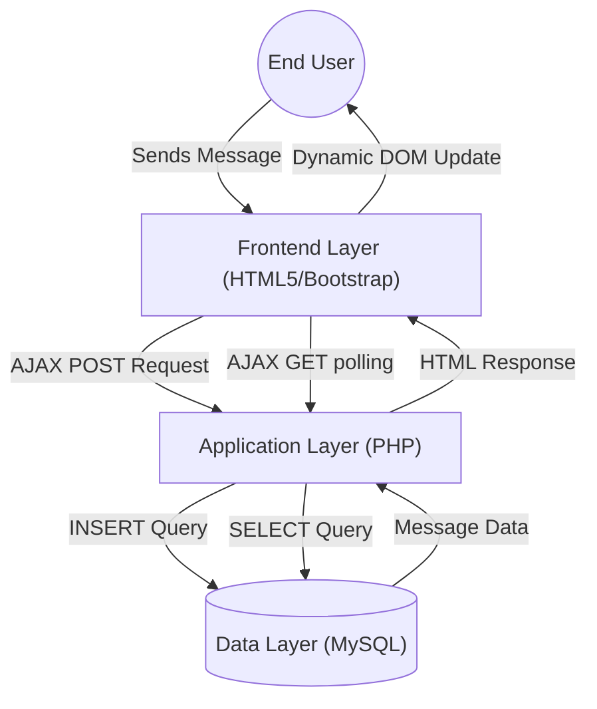

# Technical Specification: CHAT-ROOM

## Architectural Overview

The **CHAT-ROOM** is a web-based real-time messaging interface developed to demonstrate asynchronous communication. It utilizes a standard LAMP/WAMP stack architecture with AJAX polling to facilitate instant message updates without page refreshes.

### Data Lifecycle Diagram

---

## Technical Implementations

### 1. Backend Engine: PHP
The system employs **PHP** as the server-side scripting language to handle message processing and retrieval.
-   **AJAX Handler**: A dedicated `chat.php` script serves as the endpoint for asynchronous requests, executing SQL queries to fetch the chat history.
-   **Database Connectivity**: Utilizes `mysqli` for establishing connections to the MySQL database and executing parameterized queries to prevent SQL injection.

### 2. Data Persistence: MySQL
All chat messages are persisted within a relational **MySQL** database (`chat_info`).
-   **Schema Design**: The `chat_info` table is optimized for sequential read/write operations, storing `name`, `msg`, and `date` timestamps.
-   **Temporal Ordering**: Queries leverage the `ORDER BY id DESC` clause to ensure the most recent messages are prioritized in the data stream.

### 3. Frontend Visualization: HTML5 & jQuery
The interface utilizes a single-page architecture updated dynamically.
-   **jQuery AJAX**: The core mechanism (`script.js`) polls the server at 1-second intervals (`setInterval`) to fetch new messages, providing a near real-time experience.
-   **Bootstrap Framework**: Provides a consistent and responsive grid layout, ensuring the chat interface is accessible on various screen sizes.

---

## Technical Prerequisites

-   **Server**: Apache HTTP Server (via XAMPP/WAMP)
-   **Language**: PHP 5.x/7.x
-   **Database**: MySQL 5.x+
-   **Core Dependencies**: `Bootstrap` (CSS/JS), `jQuery`.

---

*Technical Specification | Computer Engineering Project | Version 1.0*
